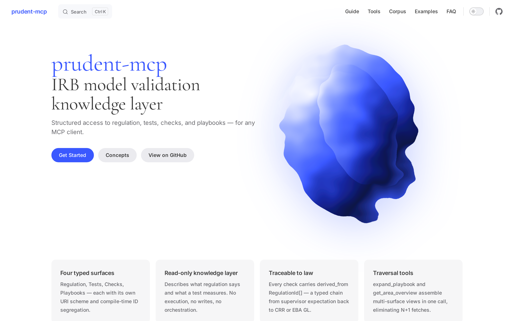

[](https://rhozacc.github.io/prudent-mcp/)

An [MCP](https://modelcontextprotocol.io) server that gives any LLM client structured access to the IRB credit-risk model validation knowledge base — regulation, statistical tests, supervisor checks, and validation playbooks.

**[Documentation](https://rhozacc.github.io/prudent-mcp/)**

---

## What it is

Validating an IRB model means cross-referencing a bank's documentation against a moving target: CRR articles, EBA guidelines, ECB guides, supervisor commentary, and statistical methodology. An LLM is well-suited to that cross-referencing — but only if it has structured access to the source material rather than relying on training-data recall.

`prudent-mcp` is the read-only knowledge layer. It defines four surfaces, each with its own URI scheme, and exposes them through MCP's standard tool/resource/prompt protocol. Any compliant client (Claude Desktop, Claude Code, Cursor, custom integrations) can plug it in.

| Surface | URI scheme | Notes |
|---|---|---|
| **Regulation** | `regulation://{framework}/{article}[/{paragraph}[/{point}]]` | Versioned per source document. `get_regulation` accepts `as_of` for historical lookups. Supports parent/child hierarchy for section-level references. |
| **Tests** | `test://{test-id}` | Statistical tests described — aliases and family grouping let Claude recognize bank-specific variants. Never executed. |
| **Checks** | `check://{area}/{topic}[/{specific}]` | Qualitative checks with a concrete pass/fail bar, traced back to law via `derived_from: RegulationId[]`. |
| **Playbooks** | `playbook://{area}[/{subarea}]` | Guided walkthroughs structured as ordered phases with mixed-surface references. |

The server does not run statistical tests, accept writes, or orchestrate workflows. Those concerns live elsewhere.

## Quickstart

```bash
bun install
bun run typecheck && bun test
bun run inspect:demo   # opens MCP Inspector pre-seeded with PD-calibration content
```

Requires [Bun](https://bun.sh) ≥ 1.1. See [the quickstart guide](https://rhozacc.github.io/prudent-mcp/guide/quickstart) for full setup.

## Connect a client

**Claude Desktop** — edit `claude_desktop_config.json`:

```json
{
  "mcpServers": {
    "prudent": {
      "command": "bun",
      "args": [
        "run",
        "/absolute/path/to/prudent-mcp/examples/inmemory-demo.ts"
      ]
    }
  }
}
```

**Claude Code** — add `.mcp.json` to your project root with the same shape. Restart the client — the `prudent` server appears in the tools list. Same config works for Cursor and any other MCP-compliant host.

## Corpus

The adapters in this repo return empty results by default. `examples/inmemory-demo.ts` seeds a working slice of PD-calibration content and is the reference implementation for any backend.

The curated **prudent corpus** — the full body of regulation, tests, checks, and playbooks — is a proprietary product shipped separately. See [Adapters](https://rhozacc.github.io/prudent-mcp/adapters/) for the interface contract.

## Stack

[Bun](https://bun.sh) · TypeScript strict · [`@modelcontextprotocol/sdk`](https://github.com/modelcontextprotocol/typescript-sdk) · [zod](https://zod.dev) · template-literal URI types for compile-time surface segregation

## License

[AGPL-3.0](./LICENSE)
