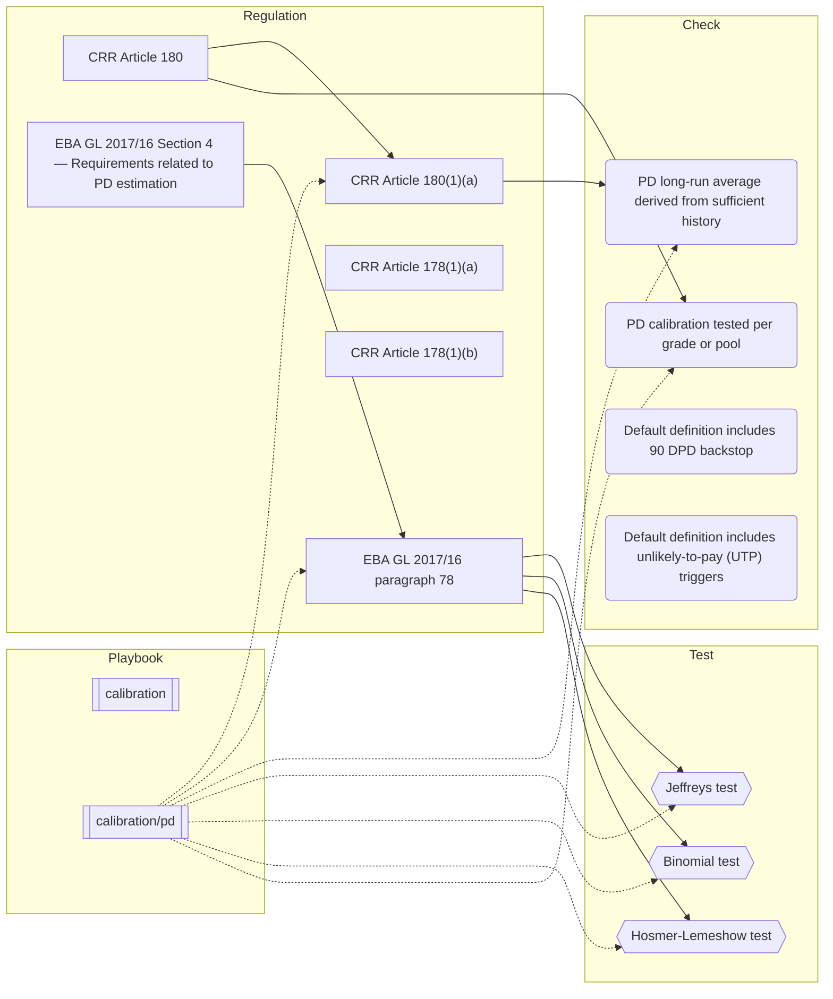

# Corpus graph

> **Auto-generated** by `bun run graph` from the bundled demo corpus — do not edit by hand. Regenerate whenever corpus data changes.

A map of how the loaded records reference each other. Node shapes encode the surface, so it reads the same in light and dark themes:

- **Regulation** — rectangle
- **Check** — rounded
- **Test** — hexagon
- **Playbook** — subroutine box

Solid arrows are `Regulation.children` (sub-regulations plus the checks/tests that operationalize a record). Dotted arrows are playbook phase references reaching across surfaces.

