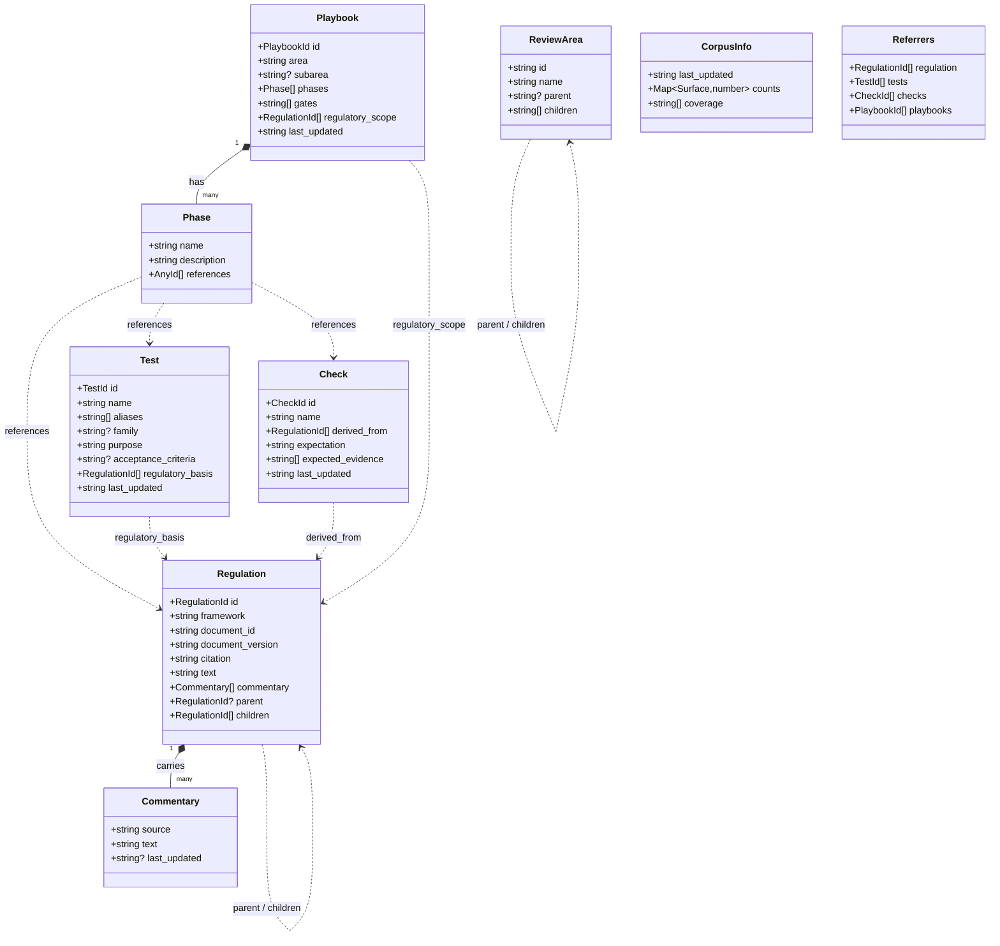
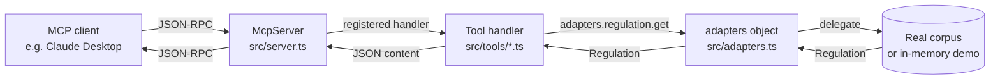

# Architecture

Three views: the surface map (how the four kinds of record reference each other), the schema (every field on every type), and the request lifecycle (what happens when a client calls a tool).

## Surface map

<svg viewBox="0 0 720 380" xmlns="http://www.w3.org/2000/svg" style="width:100%;height:auto;color:var(--vp-c-text-1);">
  
  <defs>
    <marker id="tip" viewBox="0 0 10 10" refX="9" refY="5" markerWidth="6" markerHeight="6" orient="auto">
      <path d="M0,0 L10,5 L0,10 z" fill="currentColor"/>
    </marker>
  </defs>
  <rect class="surface" x="30"  y="40"  width="220" height="120" rx="8"/>
  <text class="title" x="50" y="68">Regulation</text>
  <text class="uri"   x="50" y="90">regulation://crr/178/1/a</text>
  <text class="sub"   x="50" y="112">Versioned (document_version, as_of).</text>
  <text class="sub"   x="50" y="128">Carries inline Commentary[].</text>
  <text class="sub"   x="50" y="144">parent / children for section nesting.</text>
  <path class="self" d="M250,70 C290,50 290,110 250,90"/>
  <rect class="surface" x="470" y="40"  width="220" height="120" rx="8"/>
  <text class="title" x="490" y="68">Test</text>
  <text class="uri"   x="490" y="90">test://jeffreys</text>
  <text class="sub"   x="490" y="112">Statistical test described, not run.</text>
  <text class="sub"   x="490" y="128">family + aliases enable equivalence.</text>
  <text class="sub"   x="490" y="144">acceptance_criteria is the pass bar.</text>
  <rect class="surface" x="30"  y="220" width="220" height="120" rx="8"/>
  <text class="title" x="50" y="248">Check</text>
  <text class="uri"   x="50" y="270">check://calibration/pd/lra-derived</text>
  <text class="sub"   x="50" y="292">Qualitative pass/fail expectation.</text>
  <text class="sub"   x="50" y="308">Traced to law via derived_from.</text>
  <text class="sub"   x="50" y="324">expected_evidence[] for reviewers.</text>
  <rect class="surface" x="470" y="220" width="220" height="120" rx="8"/>
  <text class="title" x="490" y="248">Playbook</text>
  <text class="uri"   x="490" y="270">playbook://calibration/pd</text>
  <text class="sub"   x="490" y="292">Phases with mixed references.</text>
  <text class="sub"   x="490" y="308">gates[] between phases.</text>
  <text class="sub"   x="490" y="324">regulatory_scope at the top level.</text>
  <path class="ref" d="M140,220 L140,160"/>
  <rect class="lblBg" x="100" y="180" width="80" height="14" rx="2"/>
  <text class="lbl" x="140" y="190" text-anchor="middle">derived_from</text>
  <path class="ref" d="M580,220 L580,160"/>
  <rect class="lblBg" x="528" y="180" width="104" height="14" rx="2"/>
  <text class="lbl" x="580" y="190" text-anchor="middle">regulatory_basis</text>
  <path class="ref" d="M470,80 L250,80"/>
  <rect class="lblBg" x="318" y="62" width="84" height="14" rx="2"/>
  <text class="lbl" x="360" y="72" text-anchor="middle">regulatory_scope</text>
  <path class="ref" d="M250,260 L470,260"/>
  <rect class="lblBg" x="324" y="244" width="72" height="14" rx="2"/>
  <text class="lbl" x="360" y="254" text-anchor="middle">references</text>
  <path class="ref" d="M580,220 L560,160"/>
  <path class="ref" d="M470,290 L250,290"/>
  <rect class="lblBg" x="324" y="272" width="72" height="14" rx="2"/>
  <text class="lbl" x="360" y="282" text-anchor="middle">references</text>
</svg>

Solid arrows are typed cross-surface references. The dashed self-loop on Regulation is parent/children for section nesting. Every typed reference is enforced at compile time — `Check.derived_from: RegulationId[]` rejects a `TestId` before the program runs.

## Schema relationships

The dashed arrows are cross-surface references — the places where template literal types catch wrong-surface IDs at compile time.

## Request lifecycle

A single `get_regulation` call, from client to corpus and back. The seam is the `adapters` object — defaults return empty, the in-memory demo seeds maps, a production deployment points at a real corpus.

<svg viewBox="0 0 880 360" xmlns="http://www.w3.org/2000/svg" style="width:100%;height:auto;color:var(--vp-c-text-1);">
  
  <defs>
    <marker id="mt" viewBox="0 0 10 10" refX="9" refY="5" markerWidth="5" markerHeight="5" orient="auto">
      <path d="M0,0 L10,5 L0,10 z" fill="currentColor"/>
    </marker>
  </defs>
  <rect class="actor" x="20"  y="20" width="140" height="50" rx="6"/>
  <text class="name" x="90"  y="42" text-anchor="middle">MCP Client</text>
  <text class="sub"  x="90"  y="58" text-anchor="middle">Claude / Cursor</text>
  <rect class="actor" x="190" y="20" width="140" height="50" rx="6"/>
  <text class="name" x="260" y="42" text-anchor="middle">McpServer</text>
  <text class="sub"  x="260" y="58" text-anchor="middle">src/server.ts</text>
  <rect class="actor" x="360" y="20" width="140" height="50" rx="6"/>
  <text class="name" x="430" y="42" text-anchor="middle">Tool handler</text>
  <text class="sub"  x="430" y="58" text-anchor="middle">src/tools/regulation.ts</text>
  <rect class="actor" x="530" y="20" width="140" height="50" rx="6"/>
  <text class="name" x="600" y="42" text-anchor="middle">adapters</text>
  <text class="sub"  x="600" y="58" text-anchor="middle">src/adapters.ts</text>
  <rect class="actor" x="700" y="20" width="160" height="50" rx="6"/>
  <text class="name" x="780" y="42" text-anchor="middle">Backend</text>
  <text class="sub"  x="780" y="58" text-anchor="middle">in-memory demo / HTTP</text>
  <line class="life" x1="90"  y1="70" x2="90"  y2="350"/>
  <line class="life" x1="260" y1="70" x2="260" y2="350"/>
  <line class="life" x1="430" y1="70" x2="430" y2="350"/>
  <line class="life" x1="600" y1="70" x2="600" y2="350"/>
  <line class="life" x1="780" y1="70" x2="780" y2="350"/>
  <path class="msg" d="M90,100  L255,100"/>
  <text class="label" x="172" y="94" text-anchor="middle">JSON-RPC: get_regulation</text>
  <path class="msg" d="M260,140 L425,140"/>
  <text class="label" x="342" y="134" text-anchor="middle">registered handler</text>
  <path class="msg" d="M430,180 L595,180"/>
  <text class="label" x="512" y="174" text-anchor="middle">adapters.regulation.get</text>
  <path class="msg" d="M600,220 L775,220"/>
  <text class="label" x="687" y="214" text-anchor="middle">backend lookup</text>
  <path class="ret" d="M775,260 L605,260"/>
  <text class="label" x="690" y="254" text-anchor="middle">Regulation | null</text>
  <path class="ret" d="M600,290 L435,290"/>
  <text class="label" x="517" y="284" text-anchor="middle">Regulation | null</text>
  <path class="ret" d="M430,320 L265,320"/>
  <text class="label" x="347" y="314" text-anchor="middle">JSON content</text>
  <path class="ret" d="M260,345 L95,345"/>
  <text class="label" x="177" y="339" text-anchor="middle">JSON-RPC response</text>
</svg>

The `adapters` object is the seam. Default implementations return empty; `examples/inmemory-demo.ts` reassigns the handles to seed in-memory data, and a backend adapter would do the same against its own storage.

## Where the boundaries are

| Concern | Lives where |
|---|---|
| Tool/resource/prompt registration | `src/server.ts` |
| Per-surface tool handlers | `src/tools/{regulation,tests,checks,playbooks}.ts` |
| Cross-cutting tools | `src/tools/meta.ts` |
| Adapter interfaces + handle object | `src/adapters.ts` |
| Schemas (zod + template literal types) | `src/schema.ts` |
| Prompt scaffolds | `src/prompts/` |
| Reference adapter for development | `examples/inmemory-demo.ts` |

The schema file is upstream of everything else — `src/server.ts`, the tool handlers, and the adapters all import from it. Changes there ripple, by design.
