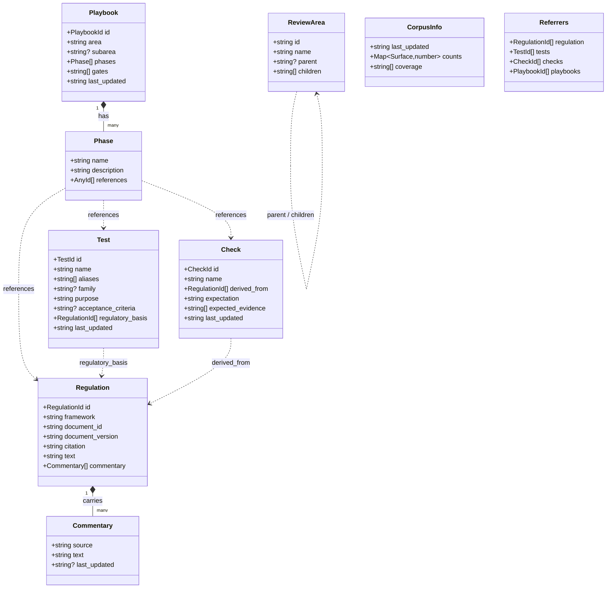
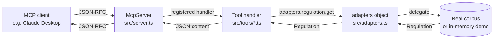

# Architecture

Two diagrams: schema relationships, and the request flow from MCP client through to adapter.

## Schema relationships

The dashed arrows are cross-surface references — the places where template literal types catch wrong-surface IDs at compile time.

## Request flow

The `adapters` object is the seam. Default implementations return empty; `examples/inmemory-demo.ts` reassigns the handles to seed in-memory data, and a backend adapter would do the same against its own storage.
