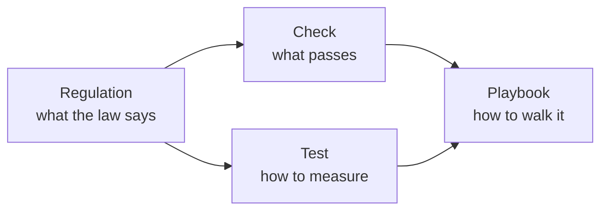

# Concepts

The corpus models a specific working domain — internal ratings-based (IRB) credit-risk model validation. This page explains the concepts the schema is built around. If you've never read the CRR or the EBA guidelines on PD-LGD estimation, start here.

If you already know the domain and want the schema, skip to [Corpus structure](/corpus/).

## The four surfaces, conceptually

<svg viewBox="0 0 720 220" xmlns="http://www.w3.org/2000/svg" style="width:100%;height:auto;color:var(--vp-c-text-1);">
  
  <defs>
    <marker id="a" viewBox="0 0 10 10" refX="9" refY="5" markerWidth="6" markerHeight="6" orient="auto">
      <path d="M0,0 L10,5 L0,10 z" fill="currentColor"/>
    </marker>
  </defs>
  <rect class="box" x="30"  y="60"  width="140" height="80" rx="6"/>
  <text class="label" x="100" y="92"  text-anchor="middle">Regulation</text>
  <text class="sub"   x="100" y="112" text-anchor="middle">what the law says</text>
  <rect class="box" x="220" y="20"  width="140" height="80" rx="6"/>
  <text class="label" x="290" y="52"  text-anchor="middle">Test</text>
  <text class="sub"   x="290" y="72"  text-anchor="middle">how to measure</text>
  <rect class="box" x="220" y="120" width="140" height="80" rx="6"/>
  <text class="label" x="290" y="152" text-anchor="middle">Check</text>
  <text class="sub"   x="290" y="172" text-anchor="middle">what passes</text>
  <rect class="box" x="540" y="60"  width="140" height="80" rx="6"/>
  <text class="label" x="610" y="92"  text-anchor="middle">Playbook</text>
  <text class="sub"   x="610" y="112" text-anchor="middle">how to walk it</text>
  <path class="arrow" d="M170,90  L220,60"/>
  <path class="arrow" d="M170,110 L220,160"/>
  <path class="arrow" d="M360,60  L540,90"/>
  <path class="arrow" d="M360,160 L540,110"/>
</svg>

The four surfaces correspond to the four kinds of artifact you actually deal with on a validation:

- **Regulation** is what the supervisor and the law require. It's the ground truth and the only versioned surface.
- **Tests** are the statistical procedures — Hosmer-Lemeshow, Jeffreys, AUROC, Brier score — that turn portfolio data into evidence.
- **Checks** are the qualitative bar: a concrete pass/fail expectation, traced back to the regulation it operationalises.
- **Playbooks** are the walkthroughs that combine all of the above into an ordered review.

## IRB in one paragraph

Under the Capital Requirements Regulation (CRR), banks can use their own internal models — rather than standardised risk weights — to compute regulatory capital for credit risk. The model has to estimate, for each obligor or facility, a probability of default (PD), a loss given default (LGD), and an exposure at default (EAD). The supervisor approves the model and then validates it on an ongoing basis. Validation means proving the model is calibrated, discriminating, and aligned with the regulation — including how default is defined, how the data history is used, and how downturn conditions are reflected.

## The eight concepts the corpus is built around

### 1. Default definition

The trigger that flips an obligor from performing to defaulted. CRR Article 178 defines it: 90 days past due **or** unlikely to pay. The EBA Guidelines on the application of the default definition (EBA/GL/2016/07) spell out the mandatory indicators of unlikely-to-pay. Every downstream estimate (PD, LGD, EAD) is conditioned on this definition, so any drift between the definition the bank applies and the regulation is a finding.

### 2. PD calibration

PD calibration is the assertion that **observed default rates match estimated PDs**. The CRR mandates that PDs are estimated from long-run averages of one-year default rates (Art. 180). "Long-run" is at least one full economic cycle (EBA GL 2017/16 para 78), typically five+ years.

Calibration is tested at grade level (Jeffreys, one-sided binomial) and at portfolio level (Hosmer-Lemeshow, Brier score). All of these are members of the `calibration-binomial` or `calibration-grouped` families in the corpus.

### 3. Discriminatory power

Whether the model ranks defaults higher than non-defaults. AUROC, Gini, KS-statistic, accuracy ratio — all measure discrimination, all are members of the `discrimination` family. The supervisory bar is "appropriate level of differentiation," typically read as AUROC ≥ 0.7 with documented justification.

### 4. Long-run average (LRA)

The denominator of every PD estimate. The LRA period must cover a full economic cycle, the default definition must be consistent across the period, and the data must be representative of the current portfolio. Drift on any of those is a finding — and the corpus has a check for each (`check://calibration/pd/lra-derived`).

### 5. Downturn LGD / EAD

LGD and EAD must reflect downturn conditions (CRR Art. 181, 182). The EBA RTS on downturn LGD specifies the methodology. The corpus models downturn separately from baseline calibration because the downturn adjustment is its own validation surface.

### 6. Margin of conservatism (MoC)

An additive buffer applied to PD, LGD, or EAD to compensate for known weaknesses in the estimate — data quality issues, methodological limitations, general estimation error. EBA GL 2017/16 categorises MoC into Category A (data deficiencies), Category B (methodological), Category C (general). Every applied MoC needs a documented justification and a quantification approach.

### 7. Representativeness

The data used to estimate the model must represent the current portfolio and the period of application. Representativeness assessments compare the development sample to the application portfolio across obligor type, geography, vintage, and product. EBA GL para 84 onwards.

### 8. Rating philosophy

Point-in-time (PIT) vs through-the-cycle (TTC). A PIT rating moves with the cycle; a TTC rating is stable. The bank declares its philosophy and the validation has to confirm the data and calibration are consistent with it. This is a structural question, not a numeric one — and there's an entire playbook for it.

## Where the corpus stops

The MCP describes — it doesn't execute. Concretely:

- ✅ It tells you what the Hosmer-Lemeshow test measures and how to read the p-value.
- ❌ It doesn't run the test on portfolio data.
- ✅ It tells you what evidence a `check://calibration/pd/lra-derived` requires.
- ❌ It doesn't gather the evidence or judge whether it's sufficient.
- ✅ It serves the regulatory text in force on a given date.
- ❌ It doesn't decide whether the bank complied with that text.

That boundary is load-bearing. Execution and judgement happen elsewhere — typically `prudent-runtime` for statistical computation and the model owner / validator for judgement. The MCP keeps the knowledge layer pure.

## How LLMs use this

A well-equipped LLM client (Claude Desktop, Claude Code, Cursor) talks to `prudent-mcp` and the analyst at the same time. The model:

1. Parses the analyst's question or the bank's documentation.
2. Resolves prose citations (`"Art. 178(1)(a)"`) into structured `regulation://` URIs via `resolve_citation`.
3. Pulls verbatim regulation text and any attached commentary.
4. Walks the `derived_from` chain on relevant checks.
5. Maps bank-specific test names onto corpus entries through the `family` and `aliases` fields.
6. Cites everything back to the analyst with structured IDs.

The model does the reasoning. The MCP makes sure the reasoning is grounded in primary sources rather than training-data guesswork.
